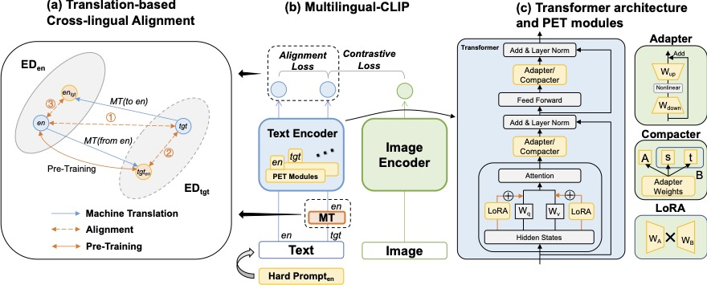

# Parameter-Efficient Cross-lingual Transfer of Vision and Language Models via Translation-based Alignment

This repo contains the official implementation for our EMNLP 2023 paper [Parameter-Efficient Cross-lingual Transfer of Vision and Language Models via Translation-based Alignment](https://arxiv.org/abs/2305.03510)

    
## Abstract




    
Pre-trained vision and language models such as CLIP have witnessed remarkable success in connecting images and texts with a primary focus on English texts. Despite recent efforts to extend CLIP to support other languages, disparities in performance among different languages have been observed due to uneven resource availability.
Additionally, current cross-lingual transfer methods of those pre-trained models would consume excessive resources for a large number of languages. 
Therefore, we propose a new parameter-efficient cross-lingual transfer learning framework that utilizes a translation-based alignment method to mitigate multilingual disparities and explores parameter-efficient fine-tuning methods for parameter-efficient cross-lingual transfer. 
Extensive experiments on XTD and Multi30K datasets, covering 11 languages under zero-shot, few-shot, and full-dataset learning scenarios, show that our framework significantly reduces the multilingual disparities among languages and improves cross-lingual transfer results, especially in low-resource scenarios, while only keeping and fine-tuning an extremely small number of parameters compared to the full model (e.g., Our framework only requires 0.16\% additional parameters of a full-model for each language in the few-shot learning scenario).


## Installation
This code is built on [Multilingual-CLIP](https://github.com/FreddeFrallan/Multilingual-CLIP) and [OpenDelta](https://github.com/thunlp/OpenDelta). You should install them following their instruction. Then run:
```
pip install -r requirement
```


    
#### Scripts: 
 We provide example scripts in `scripts/` to reproduce the results in our paper
    
baseline
```
bash scripts/grid_baseline1/de.sh
```

routine1/2/3
```
bash scripts/grid_method1/de.sh
```


## Citation

Please considering citing our paper as below if you find it useful. Thank you!

```bibtex
@article{zhang2023parameter,
  title={Parameter-Efficient Cross-lingual Transfer of Vision and Language Models via Translation-based Alignment},
  author={Zhang, Zhen and Wang, Jialu and Wang, Xin Eric},
  journal={arXiv preprint arXiv:2305.03510},
  year={2023}
}
```